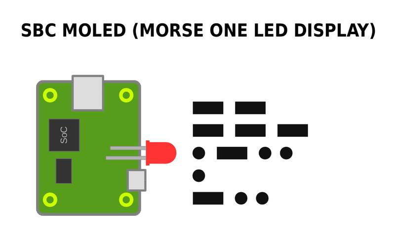
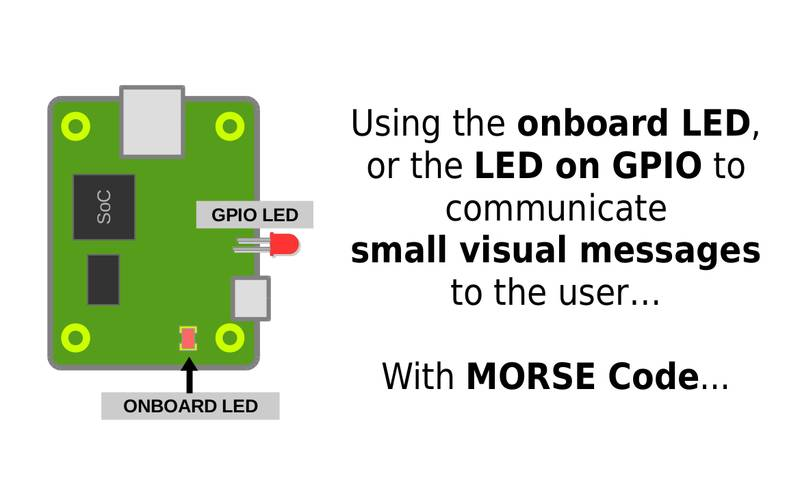
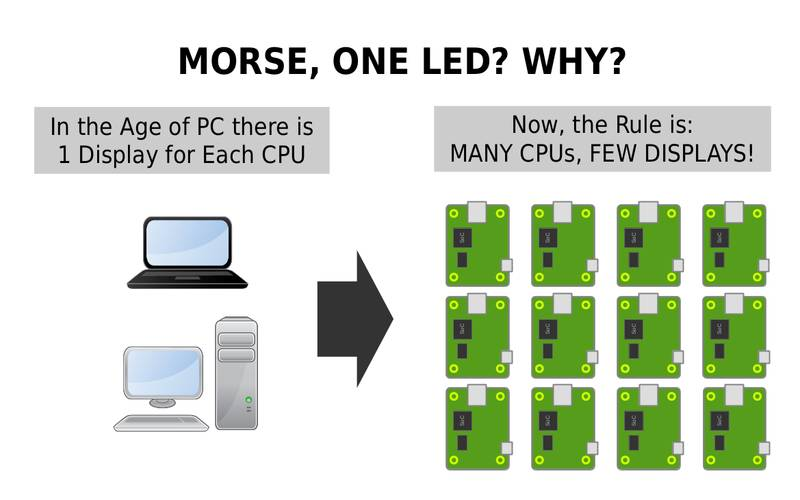
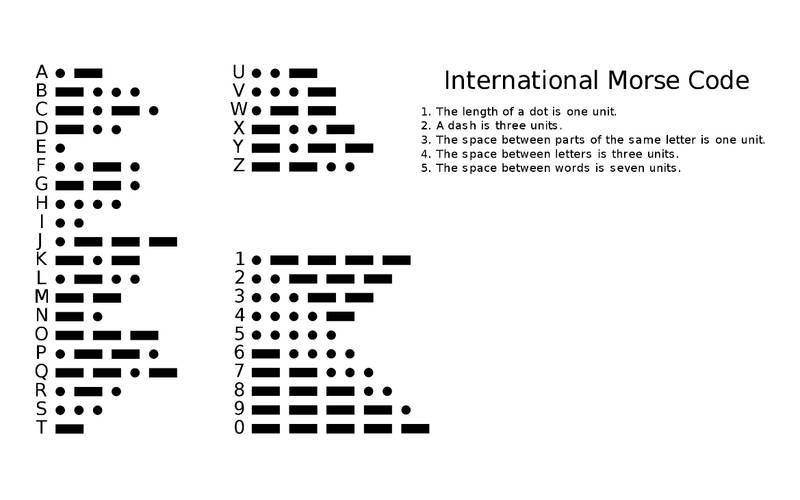
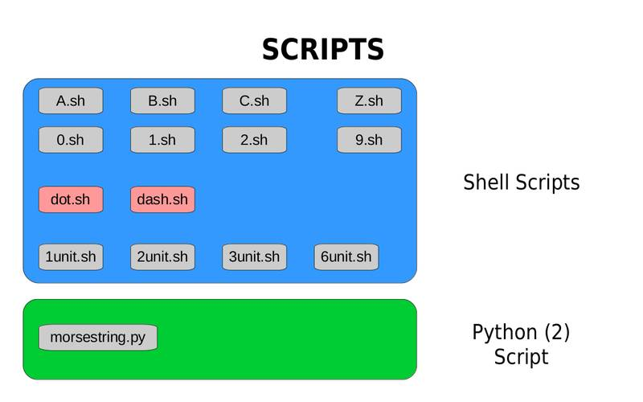

# SBC MOLED  
**Morse One LED Display**  
  
  
  
The idea is very simple and very easy!  
To use the SBC onboard (or a GPIO) LED to signal Morse Code!  
For very short and very simple messages, it will work as a "Display" for any general communication...  
  
  
  
  
  
As the picture above shows (argue), in the Age of Desktop PC the average was having 1 monitor screen for each PC, but in the Age of SBCs, we should expect having a large number of SBCs operating without a connection to a monitor display...  
  
This is where using the onboard LED with Morse Code does make sense...  
As long as the needed message is short and simple, a single LED should be enough to give the user some information...  
  
  
**The Morse Code**
  
  
**Sample Scripts**
  
There is a basic sample script that allows us to test the idea and see its utility...  
The code is intended to be as easy as possible to be undertood and modified by almost anybody, even with very litthe knowledge of coding...  
  
For now (NOV/2019), there is code for the NanoPI NEO SBC and also for the RaspberryPI 3 SBC.  
  
Adapting for any other SBC should be a 2 lines work, very easy!  
One line for switching OFF the LED...
One line for switching ON the LED...
  
  
**How to use**
  
To signal the letter "A" for example:  
sudo  ./A.sh  
  
Digit "9":  
sudo  ./9.sh  
  
  
To signal a word or phrase (string):  
sudo  python  morsestring.py  hello  
  
sudo  python  morsestring.py  "sbc led"  
  
